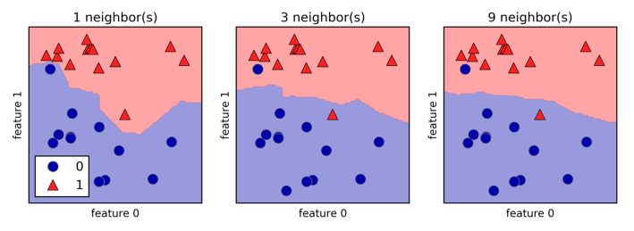

# K-nearest-neighbors (Classifier)

Simplest ML algorithm, the entire training set $X_{train}$ is stored in memory, and the classification is done by comparing the test point to all the training points. When $n = 1$,  the test point will receive the same label as its closest neighbor.

When considering more than one neighbor, we use voting to assign a label. This means that for each test point, we count how many neighbors belong to class 0 and how many neighbors belong to class 1. We then assign the class that is more frequent: in other words, the majority class among the k-nearest neighbors. There is another variant in which there is a weight for each neighbor, for example, the closer the neighbor is to the test point, the more weight it has.



The _decision boundary_ is the line that separates classes. It is easily seen here given that we are working with a 2-dimensional dataset.

## Model complexity

More neighbors will lead to a smoother _decision boundary_, in other words, a simpler model (_underfitting_, on the other hand, fewer neighbors will lead to a more complex model (_overfitting_). If we set the number of neighbors to be equal to the number of data points in the training set, every single prediction will just match the most frequent class in the dataset.

## Considerations

There are just 2 important parameters of this model:

1. Number of neighbors
	- Smaller $n$ leads to complex models, bigger $n$ to simpler ones.
2. How the distance is calculated
	- The default method is the _Euclidean distance_ but more complex methods exist.

**KNN** is an overall easy method to understand and deploy, however predictions get slower as the dataset grows in size; it is also not suitable for higher dimension datasets, and it performs really bad for datasets where most features are filled with 0 (also called _sparse datasets_).

## Implementation

Basic example of K-Nearest Neighbors Classifier using `sklearn`

```python
# Dependencies
import numpy as np
import pandas as pd
import matplotlib.pyplot as plt
from sklearn.neighbors import KNeighborsClassifier
from sklearn.model_selection import train_test_split

# Data cleaning
fruits = pd.read_table('data/fruit_data_with_colors.txt')
feature_names = ['mass', 'width', 'height', 'color_score']
target_names = ['apple', 'mandarin', 'orange', 'lemon']
X = fruits[feature_names]
y = fruits['fruit_label']

# Model training
from sklearn.preprocessing import MinMaxScaler
X_train, X_test, y_train, y_test = train_test_split(X, y, random_state=0)

# Model 1
knn = KNeighborsClassifier()
knn.fit(X_train, y_train)
print(f'''Unscaled training set model
Accuracy of KNN on training set: {knn.score(X_train, y_train):.3f}
Accuracy of KNN on test set: {knn.score(X_test, y_test):.3f}\n''')

# Model 2: Scaling every feature so all of them start with the same relevance,
# see https://stats.stackexchange.com/a/287439 for further details
scaler = MinMaxScaler()
X_train_scaled = scaler.fit_transform(X_train)
X_test_scaled = scaler.transform(X_test)

knn_scaled = KNeighborsClassifier(n_neighbors=5)
knn_scaled.fit(X_train_scaled, y_train)
print(f'''Scaled training set model
Accuracy of KNN-scaled on training set: {knn_scaled.score(X_train_scaled, y_train):.3f}
Accuracy of KNN-scaled on test set: {knn_scaled.score(X_test_scaled, y_test):.3f}\n''')

# Prediction
# ['height', 'width', 'mass', 'color_score']
example_fruit = [[5.5, 2.2, 10, 0.70]]
example_fruit_scaled = scaler.transform(example_fruit)
example_fruit_dict = dict(zip(feature_names, example_fruit[0]))
print(f'''Predictions
(Scaled) Prediction for {example_fruit_dict} -> {target_names[knn_scaled.predict(example_fruit_scaled)[0] - 1]}
(Regular) Prediction for {example_fruit_dict} -> {target_names[knn.predict(example_fruit)[0] - 1]}''')

"""
OUTPUT:
Unscaled training set model 
Accuracy of KNN on training set: 0.795
Accuracy of KNN on test set: 0.533 

Scaled training set model 
Accuracy of KNN-scaled on training set: 0.955 
Accuracy of KNN-scaled on test set: 1.000 

Predictions 
(Scaled) Prediction for {'height': 5.5, 'width': 2.2, 'mass': 10, 'color_score': 0.7} -> mandarin 
(Regular) Prediction for {'height': 5.5, 'width': 2.2, 'mass': 10, 'color_score': 0.7} -> mandarin
"""
```
