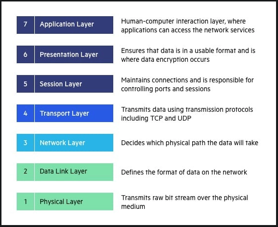
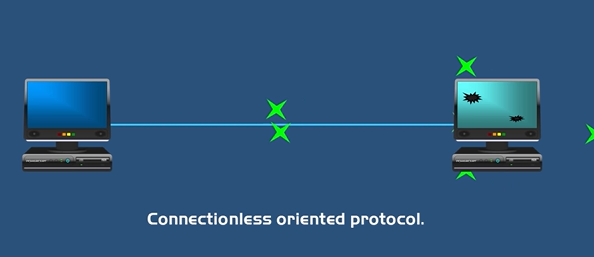
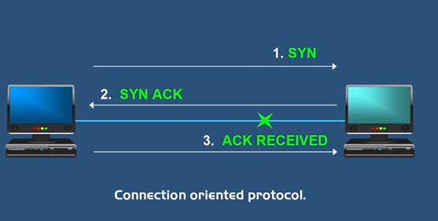
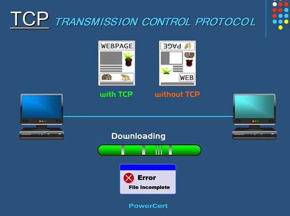

# Network Security

- [Network Security](#network-security)
  - [OSI model (Open System Interconnection)](#osi-model-open-system-interconnection)
    - [Layer Architecture](#layer-architecture)
  - [Protocols](#protocols)
    - [IP (Internet Protocol)](#ip-internet-protocol)
      - [IPv4](#ipv4)
      - [IPv6](#ipv6)
    - [User Datagram Protocol](#user-datagram-protocol)
    - [Transfer Control Protocol](#transfer-control-protocol)
    - [Stream Control Transmission Protocol](#stream-control-transmission-protocol)
    - [Domain Name System](#domain-name-system)
  - [Ports](#ports)
    - [Port Numbers](#port-numbers)
  - [New commands](#new-commands)

## OSI model (Open System Interconnection)

> A conceptual model that describes the universal standard of communication functions of a telecommunication system or computing system, without any regard to the system's underlying internal technology and specific protocol suites

### Layer Architecture

1. Physical layer: Transmission and reception of raw bit streams over a physical medium
   - PDU: Bit, symbol
2. Data Link layer: Transmission of data frames between 2 nodes connected by a physical layer
   - PDU: Frame
   - Ethernet Protocol
3. Network layer: Structuring and managing a multi-node network, including addressing, routing and traffic control
   - PDU: Packet
   - Internet Protocol
4. Transport layer: Reliable transmission of data segments between points on a network, including segmentation, acknowledgement and _multiplexing_
   - PDU: Segment, datagram
   - UDP, TCP protocol
5. Session layer: Managing communication sessions, i.e., continuous exchange of information in the form of multiple back-and-forth transmissions between two nodes
   - PDU: Data
6. Presentation layer: Translation of data between a networking and an application; including character encoding, data compression and encryption-decryption
   - PDU: Data
7. Application layer: High-level APIs, including resource sharing, remote file access
   - PDU: Data
   - DNS, FTP, HTTP, HTTPS, etc...



## Protocols

### IP (Internet Protocol)

> Network layer communications protocol in the internet protocol suite for relaying datagrams across network boundaries. Its routing function enables internetworking, and essentially establishes the internet. Said communication can be established through some unique ids, called IPv4 and IPv6.

#### IPv4

Made by 4 bytes (32 bits), where each of those holds a value between 0 and 255, and each of those is represented in decimal notation. Ex: 169.254.38.87

For this format there exists 5 sub-classes, which determine into how many elements a network can be split.

1. Class A: (0.0.0.0 - 127.255.255.255), $2^{7}$ networks and $2^{24}$ addresses per network
2. Class B: (128.0.0.0 - 191.255.255.255), $2^{14}$ networks and $2^{16}$ addresses per network
3. Class C: (192.0.0.1 - 223.255.255.255), $2^{21}$ networks and $2^{8}$ addresses per network
4. Class D: (224.0.0.1 - 239.255.255.255), $X$ networks and $X$ addresses per network
5. Class E: (240.0.0.0 - 255.255.255.255), $X$ networks and $X$ addresses per network

Classes A, B and C are made to be assigned to local networks.

> Why class C and D do not finish with a 0?

#### IPv6

Since there are only $2^{32}$ networks in IPv4, IPv6 was created, it can hold up to $2^{128}$ networks. It has 8 fields of 16 bits each, for a grand total of 128 bits. Each field of 16 bits is represented in hexadecimal notation. Example:

$$
    2001:4998:24:120d::1:1 \\
    2001:4998:0024:120d:0000:0000:0001:0001
$$

It can be represented in 2 formats, long and short. See:

$$\begin{gather*}
    2001:4998:24:120d::1:1 \equiv 2001:4998:0024:120d:0000:0000:0001:0001
\end{gather*}$$

<!-- IETF => Internet Engineering Task Force
DHCP => Dynamic Host Control Protocol -->

### User Datagram Protocol

A connectionless oriented protocol. Computer applications can send messages, in this case referred to as datagrams, to other hosts on an IP protocol network. It uses a simple connectionless communication model with a minimum of protocol mechanisms. UDP provides _checksums_ for data integrity, and port numbers for addressing different functions at the source and destination of the datagram. It has no handshaking dialogues, and thus exposes the user's program to the unreliability of the underlying network; there is no guarantee of delivery, ordering or duplicate protection.

> Prior communications are not required in order to setup communication channels or data paths.



### Transfer Control Protocol

A connection oriented protocol. TCP provides reliable, ordered and error checked delivery of a stream of bytes between applications running on hosts communicating via an IP network. A connection between client and server is established before data can be sent. The server must be listening (passive open) for connection requests from clients before a connection is established. Three-way handshake (active open), retransmission, and error detection adds to reliability but lengthens latency. Applications that do not require **reliable** _data stream_ may use the [User Datagram Protocol](#user-datagram-protocol).



> Used to guarantee that all data is received and in order



### Stream Control Transmission Protocol

### Domain Name System

The hierarchical and decentralized naming system used to identify computers reachable through the internet or other IP networks. The resource records contained in the DNS associate _domain names_ with other forms of information. In _lesser words_, it allows us to translate the website name (**Qualified Domain Name) to its IP address.

> It serves as the phone book for the Internet by translating human-friendly computer hostnames into IP addresses.

## Ports

A port is a virtual point where network connections start and end. Ports are software based and managed by a computer's operating system. Each port is associated with a specific process or service. Ports allow computers to easily differentiate between different kinds of traffic.

Ports are standardized across all network-connected devices, with each port assigned a number. Most ports are reserved for certain protocols, for example, most HTTP messages go to port 80.

### Port Numbers

1. Ports 20 and 21: File Transfer Protocol (FTP), transferring files between a client and a server
2. Port 22: Secure Shell. SSH is one of many tunneling protocols that create secure network connections
3. Port 25: Simple Mail Transfer Protocol (SMTP), email
4. Port 53: [Domain Name System](#domain-name-system) (DNS)
5. Port 80: Hypertext Transfer Protocol (HTTP), web browser
6. Port 123: Network Time Protocol (NTP), allows computer clocks to sync with each other, an essential process for **encryption**
7. Port 179: Border Gateway Protocol (BGP), establishing efficient routes between the large networks that make up the Internet
8. Port 443: HTTP Secure (HTTPS), web browser
9. Port 500: Internet Security Association and Key Management Protocol (ISAKMP), to set-up secure IPsec connections
10. Port 3389: Remote Desktop Protocol (RDP), enables user to remotely connect to their desktop computers from another device

[More info](https://www.cloudflare.com/learning/network-layer/what-is-a-computer-port/)

## New commands

```ps1
nslookup website-adress.com
```
