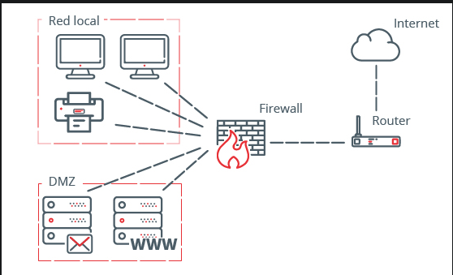

# Firewall

- [Firewall](#firewall)
  - [What it offers](#what-it-offers)
  - [What it does](#what-it-does)
  - [What it should actually do](#what-it-should-actually-do)
  - [Variants](#variants)
    - [Packet Filtering](#packet-filtering)
    - [Stateful Inspection](#stateful-inspection)
    - [Proxy](#proxy)
    - [Unified Threat Management (UTM)](#unified-threat-management-utm)
    - [Next Generation (NGFW)](#next-generation-ngfw)
    - [Threat Focused NGFW](#threat-focused-ngfw)
    - [Virtual](#virtual)
  - [Classic Firewall](#classic-firewall)
    - [Overview](#overview)
    - [Process](#process)
    - [General rules of operation](#general-rules-of-operation)
  - [Zone Based Firewall](#zone-based-firewall)
    - [Features](#features)
  - [Demilitarized Zones (DMZ)](#demilitarized-zones-dmz)
    - [Design rules](#design-rules)
    - [Actions](#actions)
    - [Actions and rules table](#actions-and-rules-table)
  - [Review](#review)

> Network security device that monitors incoming and outgoing network traffic, and decides whether to allow or block specific traffic based on a defined set of security rules

## What it offers

- Mitigate possible attacks at a network level.
- Concentrate traffic between all the elements connected to it.
- Helps to control the connection between the devices and the flux of messages on heterogeneous networks.
  - More specifically, it reinforces access control politics between local networks and the internet.

## What it does

- Allow a connection (Allow)
- Block a connection (Deny)
- Redirect a connection without notifying the emitting device (Redirect)

## What it should actually do

1. Allow DNS consults from a local network to the internet.
2. Allow web browsing from a local network to an exterior one.
3. Allow access to some services from within a local network to an exterior one.
4. Limit DNS consults from an exterior network.
5. Limit web browsing from the exterior to a local network.
6. Limit access to services from the exterior to a local network.

## Variants

### Packet Filtering

- Normally deployed on the routers which connect the internal network to the internet. It works on the layer's 3 and 4 of the OSI model.
- Work on the basis of rules defined by Access Control Lists. They check all the packets and screen them against the rules defined by the network administrator as per the ACLs.
  - If in case, any packet does not meet the criteria then that packet is dropped and Logs are updated about this information.
- Administrators can create their ACLs on the basis Address, Protocols and Packet attributes.
- It does not keep a state of the connection, clear disadvantage since each packet is treated differently, and it is not always true

It's biggest advantage is it's cost and lower resource usage, it's ideal for smaller networks. A disadvantage is that they can only work on the Network Layer, plus they do not support complex rule based models.

### Stateful Inspection

> Allows or blocks traffic based on state, port and protocol. It monitors all activity from the opening of a connection until it is closed. Filtering decisions are made based on both administrator-defined rules as well as context, which refers to using information from previous connections and packets belonging to the same connection.

Works on layers 3, 4 and 5 of the OSI model. When acting on the fifth layer it's able to take into account the state of the connection to verify dependencies between packets, to then store that connection's state into a _state table_.

- More resistant to network attacks such as IP spoofing or DoS.
- Stores the state of the connections.
- Not capable of checking the final layer of the OSI model.
- Does not work with connectionless protocols such as UDP.

### Proxy

Serves as the gateway from one network to another for a specific application, can provide additional functionality such as content caching and security by preventing direct connections from outside the network. This may also impact throughput capabilities and the applications they can support.

### Unified Threat Management (UTM)

> An approach to information security where a single hardware or software installation provides multiple security functions.

Combines the functions of a stateful inspection firewall with intrusion prevention and antivirus. It may also include additional services and often cloud management. UTM's focus on simplicity and ease of use.

### Next Generation (NGFW)

Designed to block modern threats such as advanced malware and application layer attack. A NGFW must include:

1. Standard firewall capabilities like stateful inspection
2. Integrated intrusion prevention
3. Application awareness and control to see and block risky  apps
4. Upgrade paths to include future information needs
5. Techniques to address evolving security threats
   1. Use of an Intrusion Prevention System (IPS)
   2. Implementation of VPNs, a Security Parameter Index (SPI), and Network Address Translation (NAT)

### Threat Focused NGFW

Includes all the capabilities of a traditional NGFW and also provide advanced threat detection and remediation, with a firewall such as this you can:

1. Know which assets are most at risk with complete context awareness
2. Quickly react to attacks with intelligent security automation that sets policies and hardens your defenses dynamically
3. Better detect evasive or suspicious activity with network and endpoint event correlation
4. Greatly decrease the time from detection to cleanup with retrospective security that continuously monitors for suspicious activity and behavior even after initial inspection
5. Ease administration and reduce complexity with unified policies that protect across the entire attack continuum

### Virtual

Deployed as a virtual appliance in a private cloud (VMware ESXi, Microsoft Hyper-V) or public cloud (AWS, Azure, Google, Oracle) to monitor and secure traffic across physical and virtual networks. A virtual firewall is often a key component in software-defined networks (SDN).

## Classic Firewall

### Overview

What a firewall usually does:

1. To filter traffic
2. Check traffic
3. Allows intruder detection
4. Generates warnings and audits

General steps to work with a firewall:

1. Pick the internal and external interfaces where the firewall works
2. Set up the ACLs for each interface
3. Define rules of inspection
4. Apply the rules to each interface

### Process

1. Check on an interface with a given ACL to determine if the connection will be allowed or not.
2. Determine whether the connection is to be monitored depending on the type of packet through the Internetworking Operating System and inspection rules.
3. Add info on the state to monitor the connection.
4. Add a dynamic entry to the entering ACLs over the interface to allow response packets back to the internal network.
5. As soon as the session ends via the client, the dynamic entry and the state are deleted.

### General rules of operation

1. Place the firewall on the security limits (further explanation needed)
2. Firewalls are not silver bullets for cybersecurity, it's just a complement.
3. Deny all traffic as a default setting. Only permit the required traffic with minimal privileges
4. Access to the physical firewall must be restricted
5. Regularly check on the logs
6. Develop a good practice for managing the changes made to the firewall configuration
7. **Remember**, a firewall's purpose is to protect the local network from external traffic

## Zone Based Firewall

It utilizes a zone configuration model. Instead of assigning ACLs, different zones are created and assigned to interfaces. The security policies are assigned to traffic between the zones. The zone-based firewall can also use CBAC commands concurrently on a router, but not concurrently on the router interfaces.

A router is assigned to only one security zone, which can have one-to-one or many-to-one relationships. Interfaces that belong to the same zone can communicate with each other freely and the interfaces which are in different security zones cannot communicate with each other by default.

A zone provides security by establishing security borders on the network. It defines the acceptable traffic that is allowed to cross between zones through the policy restrictions. Zone-based firewalls use a new configuration policy language called _Cisco Activity Language (CPL)_. (Of course this just applies for Cisco products).

### Features

- Does not depend on ACLs
- Blocks by default unless specified otherwise
- An established policy will affect any given traffic, so there is no need for multiple ACL rules or different inspect actions

For the purposes of this course:

- Interfaces located in the same zones can communicate without restrictions.
- Otherwise, permission rules and connection inspection must be established, based on the origin of the traffic.

## Demilitarized Zones (DMZ)

An isolated network found within the internal network of an organization. Only the resources and services that must be accessed through the internet are stored there. Here's an example:

|  |
| :----------------------------------------: |
|                  **DMZ**                   |

> Generally speaking the DMZ allows connections from both the internet and the local network of the organization, but the connections that go from the DMZ to the local network are not allowed.

This design decision was taken due to servers being more prone to attacks, if a cyber-criminal were to ever compromise a server, it'll be much more complicated for him to access the organization's local network.

### Design rules

1. Determine the zones to be configured
2. Establish the policies between the zones
3. Design the physical infrastructure
4. Identify subsets within the zones and join the traffic requirements

### Actions

One can perform each of the following actions in a DMZ:

1. Inspect: to inspect a package
2. Drop: similar to the previously mentioned deny
3. Pass: similar to the previously mentioned permit, but no monitoring is done

### Actions and rules table

|  Origin  | Destination | Action |
| :------: | :---------: | :----: |
| Internet |     DMZ     |  Pass  |
| Internet |     LAN     |  Deny  |
|   DMZ    |  Internet   |  Pass  |
|   DMZ    |     LAN     |  Deny  |
|   LAN    |     DMZ     |  Pass  |
|   LAN    |  Internet   |  Pass  |

## Review

- Access control lists (ACLS)
- Zona desmilitarizada
