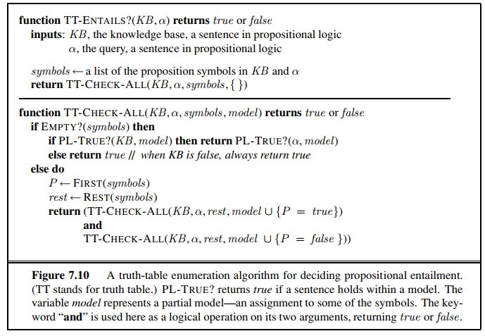

# Propositional Logic

- [Propositional Logic](#propositional-logic)
  - [Syntax](#syntax)
  - [Standard logical equivalences](#standard-logical-equivalences)
  - [Inference procedure](#inference-procedure)
  - [Examples](#examples)
    - [Tarski's World](#tarskis-world)
    - [For Tarski's World](#for-tarskis-world)

## Syntax

The syntax of propositional logic defines the allowable sentences. **Atomic sentences** consist of a single **proposition symbol**, each of those symbols represents a proposition (sentence) that can either be true or false, to represent them we use upper case letters that hold some mnemonic value, think of them as the variable names you use when programming (I hope you have good practices).

**Complex sentences** are then constructed as _atomic sentences_ connected through **logical connectives**. Below I list some of the most common connectives:

1. $\neg$ (not): To negate a sentence, if $\alpha$ is true, $\neg \alpha$ is false.
2. $\land$ (and, conjunction): Similar to the logical AND seen in electronics, if and only if $\alpha$ and $\beta$ are true, $\alpha \land \beta$ is true.
3. $\lor$ (or, disjunction): Similar to the logical OR seen in electronics, if $\alpha$ or $\beta$ is true, $\alpha \lor \beta$ is true.
4. $\Rightarrow$ (implication): A sentence such as $P \Rightarrow Q$ is called an **implication**, its premise (or antecedent) $P$ and conclusion (or consequent) $Q$. Think of them as `if-then` statements. It's true unless $P$ is true and $Q$ is false.
5. $\Leftrightarrow$ (biconditional): A sentence such as $P \Leftrightarrow Q$ is called a **biconditional**, its premise (or antecedent) $P$ and conclusion (or consequent) $Q$. It's true iff $P$ and $Q$ are both true or both false.

The previous rules can also be represented as truth tables:

| P   | Q   | $\neg P$ | $P \land Q$ | $P \lor Q$ | $P \Rightarrow Q$ | $P \Leftrightarrow Q$ |
| --- | --- | :------: | :---------: | :--------: | :---------------: | :-------------------: |
| 0   | 0   |    1     |      0      |     0      |         1         |           1           |
| 0   | 1   |    1     |      0      |     1      |         1         |           0           |
| 1   | 0   |    0     |      0      |     1      |         0         |           0           |
| 1   | 1   |    0     |      1      |     1      |         1         |           1           |

## Standard logical equivalences

| Sentence                            |                          Equivalence                          |
| :---------------------------------- | :-----------------------------------------------------------: |
| $\alpha \land \beta$                |                     $\beta \land \alpha$                      |
| $\alpha \lor \beta$                 |                      $\beta \lor \alpha$                      |
| $(\alpha \land \beta) \land \gamma$ |              $\alpha \land (\beta \land \gamma)$              |
| $(\alpha \lor \beta) \lor \gamma$   |               $\alpha \lor (\beta \lor \gamma)$               |
| $\neg (\neg \alpha)$                |                           $\alpha$                            |
| $\alpha \Rightarrow \beta$          |             $\neg \beta \Rightarrow \neg \alpha$              |
| $\alpha \Rightarrow \beta$          |                   $\neg \alpha \lor \beta$                    |
| $\alpha \Leftrightarrow \beta$      | $(\alpha \Rightarrow \beta) \land (\beta \Rightarrow \alpha)$ |
| $\neg (\alpha \land \beta)$         |                 $\neg \alpha \lor \neg \beta$                 |
| $\neg (\alpha \lor \beta)$          |                $\neg \alpha \land \neg \beta$                 |
| $\alpha \land (\beta \lor \gamma)$  |       $(\alpha \land \beta) \lor (\alpha \land \gamma)$       |
| $\alpha \lor (\beta \land \gamma)$  |       $(\alpha \lor \beta) \land (\alpha \lor \gamma)$        |

## Inference procedure

Now the goal is to decide whether $KB \models a$ for some $a$. The first devised algorithm is to enumerate all possible models and check if $a$ is true in every model in which $KB$ is also true. The algorithm `TT-Entails?` is shown bellow:

|  |
| :---------------------------------------------------: |
|                 TT Entails algorithm                  |

The previous algorithm is both sound and complete, it's sound because it directly implements the definition of entailment, and it's complete since it works for any $KB$, it always terminates. Note however that this approach will fail to work with a large $KB$. If the knowledge base and $\alpha$ contain $n$ symbols, then the time complexity of the algorithm will be $O(2^n)$, space complexity would still be $O(n)$ since the enumeration follows a depth-first approach. Don't try and be smart, propositional entailment is proven to be co-NP-complete.

## Examples

1. Juan fue a la escuela y María fue a la escuela.
    $$p: \text{Juan fue a la escuela}$$
    $$q: \text{María fue a la escuela}$$
    $$p \land q$$

2. No es el caso que me guste la mantequilla de cacahuate y la mermelada.
    $$
    p: \text{Me gusta la mantequilla de cacahuate} \\
    q: \text{Me gusta la mermelada} \\
    \neg (p \land q)
    $$
3. No me gusta la mantequilla de cacahuate y no me gusta la mermelada.
    $$
    p: \text{Me gusta la mantequilla de cacahuate} \\
    q: \text{Me gusta la mermelada} \\
    \neg p \land \neg q
    $$
4. Si los impuestos suben, aumentará la inflación.
    $$
    p: \text{Los impuestos suben} \\
    q: \text{Aumentará la inflación} \\
    p \Rightarrow q
    $$
5. Obtener una A en el examen final es una condición necesaria para obtener una A en la clase.
    $$
    p: \text{Obtener una A en el final} \\
    q: \text{Obtener una A en la clase} \\
    p \Rightarrow q
    $$
6. Obtener una B en todos los exámenes es una condición suficiente para obtener una B en la clase.
    $$
    p: \text{Obtener una B en todos los exámenes} \\
    q: \text{Obtener una B en la clase} \\
    p \Leftrightarrow q
    $$
7. No es el caso de que Tomás y Ricardo trabajen hasta tarde o que Enrique llame para reportarse enfermo.
    $$
    p: \text{Tomás trabaja hasta tarde} \\
    q: \text{Ricardo trabaja hasta tarde} \\
    j: \text{Enrique llama para reportarse enfermo} \\
    \neg (p \land q) \land j
    $$
8. Irán suministrará armas a Siria solo si Siria ayuda a Hezbollah.
    $$
    p: \text{Irán suministra armas a Siria} \\
    q: \text{Siria ayuda a Hezbollah} \\
    q \Rightarrow p
    $$
9. Julia necesita un paracaídas si y solo si planea saltar del avión.
    $$
    p: \text{Julia necesita un paracaídas} \\
    q: \text{planea saltar del avión} \\
    p \Leftrightarrow q
    $$
10. Si no tengo suficiente dinero en efectivo, puedo ir al cine o a comer fuera, pero no ambos.
    $$
    p: \text{Tengo suficiente dinero en efectivo} \\
    q: \text{Ir al cine} \\
    j: \text{Comer fuera} \\
    p \Rightarrow (q \oplus j)
    $$

### Tarski's World

1. Si a es un triángulo, entonces b también es un triángulo.
    $$
    \text{Triangle}(a) \Rightarrow \text{Triangle}(b)
    $$
2. c es un triángulo si b lo es.
    $$
    \text{Triangle}(b) \Rightarrow \text{Triangle}(c)
    $$
3. a y c son ambos triángulos solo si al menos uno de ellos es grande.
    $$
    \text{Triangle}(a) \land \text{Triangle}(c) \Leftrightarrow (\text{Large}(a) \lor \text{Large}(c))
    $$
4. a es un triángulo, pero c no es grande.
    $$
    \text{Triangle}(a) \land \neg \text{Large}(c)
    $$
5. Si c es pequeño y d es un pentágono, entonces d no es ni grande ni pequeño.
    $$
    (\text{Small(c)} \land \text{Pentagon(d)}) \Rightarrow (\neg \text{Large(d)} \land \neg \text{Small(d)})
    $$
6. c es mediano solo si ninguno de d, e y f son cuadrados.
    $$
    \text{Medium(c)} \Rightarrow (\neg \text{Square(d)} \land \neg \text{Square(e)} \land \neg \text{Square(f)})
    $$
7. d es un pentágono pequeño a menos que a sea pequeño.
    $$
    (\text{Pentagon(d)} \land \text{Small(d)}) \Rightarrow \neg \text{Small(a)}
    $$
8. e es grande si es un hecho que d es grande si y sólo si f lo es.
    $$
    (\text{Large(d)} \Rightarrow \text{Large(e)}) \Leftrightarrow \text{Large(f)}
    $$
9. d y e son del mismo tamaño.
    $$
    \text{SameSize(d, e)}
    $$
10. d y e tienen la misma forma.
    $$
    (\text{Triangle(d)} \land \text{Triangle(e)}) \lor (\text{Square(d)} \land \text{Square(e)}) \lor (\text{Pentagon(d)} \land \text{Pentagon(e)})
    $$
11. f es un cuadrado o un pentágono, si es grande.
    $$
    \text{Large(f)} \Rightarrow (\text{Square(f)} \lor \text{Pentagon(f)})
    $$
12. c es más grande que e solo si b es más grande que c.
    $$
    \text{Smaller(e,c)} \Rightarrow \text{Smaller(c, b)}
    $$

### For Tarski's World

```text
Triangle(a) => Triangle(b)
Triangle(b) => Triangle(c)
Triangle(a) /\ Triangle(c) <=> (Large(a) \/ Large(c))
Triangle(a) /\ ~Large(c)
(Small(c) /\ Pentagon(d)) => (~Large(d) /\ Small(d))
Medium(c) => (~Square(d) /\ ~Square(e) /\ ~Square(f))
(Pentagon(d) /\ Small(d)) => ~Small(a)
(Large(d) => Large(e)) <=> Large(f)
SameSize(d,e)
(Triangle(d) /\ Triangle(e)) \/ (Square(d) /\ Square(e)) \/ (Pentagon(d) /\ Pentagon(e))
Large(f) => (Square(f) \/ Pentagon(f))
Smaller(e,c) => Smaller(c,b)
```
