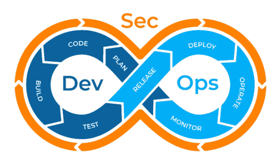

# Security in applications

- [Security in applications](#security-in-applications)
  - [DevSecOps](#devsecops)
  - [OWASP](#owasp)
    - [OWASP Top 10](#owasp-top-10)
    - [OWASP Top 10 Proactive controls](#owasp-top-10-proactive-controls)
  - [Version control](#version-control)
  - [Fuzzing](#fuzzing)
    - [Methods](#methods)

## DevSecOps

DevSecOps is based on the principle of integrating development, security, infrastructure, and operations at every stage in a product's life cycle, from planning and design to ongoing use and support (exhibit). This enables engineers to tackle security and reliability issues more quickly and effectively, making organizations more agile and their digital products and services more secure and reliable. Security, reliability and compliance considerations are built into every agile sprint rather than being handled separately or left until the end of the development process.

|  |
| :----------------------------------------------: |
|                DevSecOps process                 |

The process is broken down into the following steps:

1. **Planning**: professionals must go beyond creating feature-based descriptions, the focus should also be on security and performance, acceptance test criteria, application interface and functionality and threat defense models.
2. **Developing**: approached with a "how to do it" rather than "what to do". It is important for developers to bring together available resources for guidance, have reliable practices and a code review system in place for themselves and others in the team.
3. **Building**: automated build tools can uplift the whole DevSecOps process, these tools ensure test-driven development, standards for release artifact generation and utilize tools to ensure the design aspect is in alignment with the team's coding and security standards through static code analysis.
4. **Testing**: automated testing in DevSecOps should utilize strong testing practices including front-end, back-end, API, database and passive security testing.
5. **Securing**: traditional testing methods always remain in place in DevSecOps exercise, however, somewhere down the line, there is a tendency to identify issues toward the end of the development process.
6. **Deploying**: automated provisioning and deployment can fast-track the development process while making it a more consistent one. Infrastructure-as-Code tools can perform the aforementioned audit-properties and configurations to ensure secure configurations across the IT infrastructure.
7. **Operating**: regular monitoring and upgrades are the Operation's team important tasks. DevSecOps teams ensure to deploy Infrastructure-as-code tools to update and secure the entire organization's infrastructure in a quick and efficient manner with no scope for human error. Operations personnel have to be specially watchful of zero-day vulnerabilities.
8. **Monitoring**: constantly keeping a watch for irregularities in security can save an organization from a breach. Hence, it is essential to implement a strong continuous monitoring program with real-time to keep a track of system performance and identify any exploits in the early stages.
9. **Scaling**: gone are the days when organizations spent precious hours and money on the maintaining of large data centers, with the introduction of virtualization solutions and the cloud, organizations can scale their IT infrastructure or replace it in the event of a threat.
10. **Adapting**: continuous improvement is key to any organization's growth. An organization will only be able to achieve the desired growth if it evolves in its practices and includes DevSecOps practices.

## OWASP

> Open Web Application Security Project is  nonprofit foundation that works to improve the security of software.

### OWASP Top 10

1. Broken access control: unauthorized access to sensitive data
2. Cryptographic failures: careless use of cryptographic techniques
3. Injection: related to SQL
4. Insecure design: design errors from the origin of the project
5. Security misconfiguration: no hardening, accounts and passwords, etc...
6. Vulnerable and outdated components
7. Identification and authentication failures: breaking of the authentication process
8. Software and data integrity failures: updates from unknown sources, adulteration of data, etc...
9. Security logging and monitoring failures: there is the chance of not detecting security breaches
10. Server-side request forgery: one can obtain a fraudulent request that can direct us to an unknown website without validating it first

### OWASP Top 10 Proactive controls

1. Define security requirements
2. Leverage security frameworks and libraries
3. Secure database access
4. Encode and escape data
5. Validate all inputs
6. Implement digital identity
7. Enforce access controls
8. Protect data everywhere
9. Implement security logging and monitoring
10. Handle all errors and exceptions

## Version control

> Version control, also known as source control, is the process of tracking and managing changes to files overtime. VCS -version control systems- are software tools designed to help teams work in parallel.

It often includes the following components:

1. Publish new features in comparison with previous versions
2. Publish changed features
3. Publish bug fixes

It helps developers to:

1. A complete long-term change history of every file, this means every change made by many individuals over the years
2. Branching and merging, creating a branch in VCS tools keeps multiple streams of work independent from each other while also providing the facility to merge that work back together
3. Traceability: being able to trace each change made to the software and connect it to project management and bug tracking software in order to be able to annotate each change with a message describing the purpose and intent of said change.
4. Reducing developing time
5. Have a backup repository

In terms of security, version control systems further ease the process of auditing to track security issues. From a VCS it's easy to determine which versions were affected for then implementing the right patches.

## Fuzzing

> Fuzzing or fuzz testing is an automated software testing technique that involves providing invalid, unexpected or random data as inputs to a computer program. The program is then monitored for exceptions such as crashing, failing built-in code assertions, or potential memory leaks.

Typically, fuzzers are used to test programs that take structured inputs. The structure is specified, e.g. in a file format or protocol and distinguishes valid from invalid input. An effective fuzzer generates semi-valid inputs that they are valid enough in that they are not immediately rejected by the parser, but do create unexpected behaviors deeper in the program and are invalid enough to expose corner cases that have not been properly dealt with.

### Methods

- Black box: in the literal sense, the system is treated as a black box to which we feed some inputs and produces some outputs (usually the expected ones)
- White box: one has access to the system's source code to see which part might generate certain anomalies with a given input
- Grey box: does not have access to the source code, but may rely on debugging or reverse engineering
