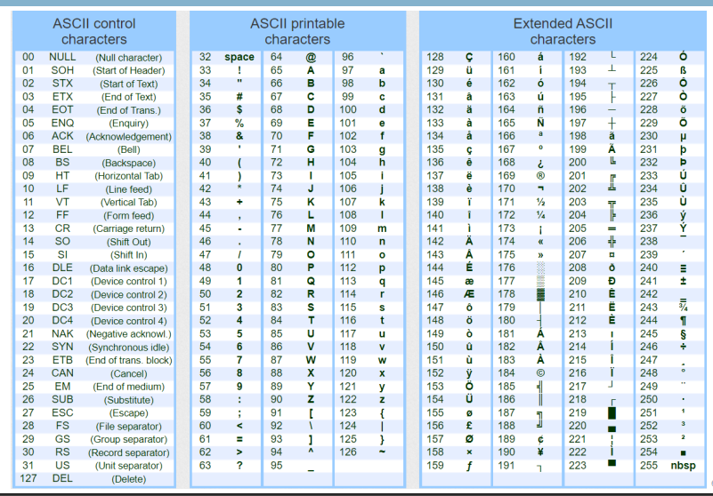
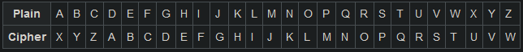
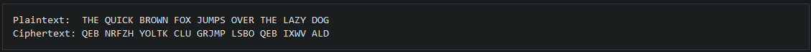

# Classical cryptography

- [Classical cryptography](#classical-cryptography)
  - [Fundamentals](#fundamentals)
  - [ASCII code](#ascii-code)
  - [Classical ciphers](#classical-ciphers)
    - [Caesar Cipher](#caesar-cipher)
      - [Encryption](#encryption)
      - [Decryption](#decryption)
    - [Monoalphabetic Cipher](#monoalphabetic-cipher)
    - [Vigenere Cipher](#vigenere-cipher)
  - [Diffie-Hellman](#diffie-hellman)
  - [Symmetric](#symmetric)
  - [Asymmetric](#asymmetric)
  - [Digital certificates and PKIs](#digital-certificates-and-pkis)

## Fundamentals

When computing we are not only looking for efficient algorithms, but also efficient ways to store data. The first thing we need to address is that computers do not work with $\mathbf{R}$ or $\mathbf{Z}$, or even decimal numbers. Computers store data with a base 2 system.

Any number in $\mathbf{Z}$ can be represented as:
$$n = \sum_{i=0}^{n} n_i \cdot (2^{i})$$

With the previous formula we get, for example, that ${509}_{10} = {111111101}_{2}$.

In computing, the bit is the basic unit of information, it can be either 0 or 1. Some other representations are used, like hexadecimal (base 16), octal (base 8), etc...

Here are some words that will be used throughout the rest of this document:

- Nibble: chain of 4 bits
- Byte: chain of 8 bits
- Word: chain of 16 bits
- Double Word: chain of 32 bits

## ASCII code

There are many ways to represent data with bits, one of the first approaches to be taken worldwide is the ASCII code, short for _American Standard Code for Information Interchange_. Here is a table with the ASCII code:

|  |
| :-------------------------------------------------------: |
|             ASCII Table of encoded characters             |

## Classical ciphers

### Caesar Cipher

One of the simplest and most widely known encryption techniques. It is a type of substitution cipher in which each letter in the plaintext is replaced by a letter some fixed number of positions down the alphabet. For example with a left shift of 3, D would be replaced by A, E would become B and so on.

The transformation can be represented by aligning 2 alphabets; the cipher alphabet is the plain alphabet rotated left or right by some number of positions. For example, here is a Caesar cipher using a left rotation of 3 places, equivalent to a right shift of 23 places:

|  |
| :-----------------------------------------------: |
|               Caesar Cipher example               |

When encrypting, a person looks up each letter of the message in the plain line and writes down the corresponding letter in the cipher line:

|  |
| :-----------------------------------------------: |
|               Caesar Cipher applied               |

The encryption can also be represented using modular arithmetic by first transforming the letters into numbers according to the scheme $A \rightarrow 0, B \rightarrow 1, C \rightarrow 2, \ldots, Z \rightarrow 25$, and then performing the encryption. Encryption of a letter $x$ by a shift $n$ can be described mathematically as:

$$\begin{gather*}
    E_n(x) = (x + n) \bmod 26 \\
    D_n(x) = (x - n) \bmod 26
\end{gather*}$$

Here are some python implementations of the Caesar cipher:

#### Encryption

```python
def encrypt_caesar(message: str, offset: int) -> str:
    """Caesar encryption with a given offset

    Args:
        message (str): Plain text to be encrypted
        offset (int): Integer offset to be used for encryption

    Returns:
        str: Cipher text
    """    

    result = ''
    for char in message:
        # Check if its uppercase
        if char.isupper():
            result += chr((ord(char) + offset - 65) % 26 + 65)
        else:
            result += chr((ord(char) + offset - 97) % 26 + 97)

    return result
```

#### Decryption

```python
def break_caesar(message: str, known_key: int = None) -> dict:
    """Brute force approach to break the Caesar cipher

    Args:
        message (str): Cipher text to be decrypted
        known_key (int, optional): Offset to be used for decryption. Defaults to None.

    Returns:
        dict: Dictionary that contains all the attempts taken to break the cipher
    """    

    alphabet = ascii_letters[len(ascii_letters) // 2:]
    res = []

    if known_key is None:
        search_space = range(len(alphabet))
    else:
        search_space = [known_key]
    
    for key in search_space:
        translated = ''
        for char in message:
            if char in alphabet:
                num = alphabet.find(char)
                num -= key
                if num < 0:
                    num += len(alphabet)
                translated += alphabet[num]
            else:
                translated += char
        
        res.append([key, translated])
        # Map list of lists to dict
        out = dict(res)

    return out
```

### Monoalphabetic Cipher

### Vigenere Cipher

Kasiski (to break Vigenère)

## Diffie-Hellman

---

## Symmetric

---

## Asymmetric

---

## Digital certificates and PKIs

---
