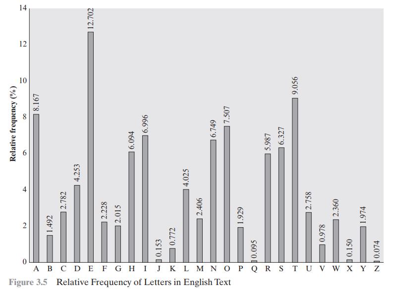
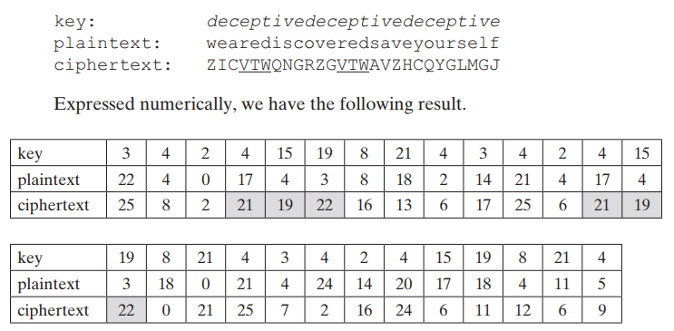

# Classical cryptography

- [Classical cryptography](#classical-cryptography)
  - [Fundamentals](#fundamentals)
  - [ASCII code](#ascii-code)
  - [Classical ciphers](#classical-ciphers)
    - [Caesar Cipher](#caesar-cipher)
      - [Encryption](#encryption)
      - [Decryption](#decryption)
    - [Monoalphabetic Cipher](#monoalphabetic-cipher)
      - [Key generation](#key-generation)
      - [Encryption method](#encryption-method)
      - [Decryption method](#decryption-method)
      - [Frequency analysis](#frequency-analysis)
    - [Vigenère Cipher](#vigenère-cipher)
      - [Key generation (Vigenère)](#key-generation-vigenère)
      - [Vigenère encryption](#vigenère-encryption)
      - [Vigenère decryption](#vigenère-decryption)
  - [Diffie-Hellman](#diffie-hellman)
  - [Symmetric](#symmetric)
  - [Asymmetric](#asymmetric)
  - [Digital certificates and PKIs](#digital-certificates-and-pkis)

## Fundamentals

When computing we are not only looking for efficient algorithms, but also efficient ways to store data. The first thing we need to address is that computers do not work with $\mathbf{R}$ or $\mathbf{Z}$, or even decimal numbers. Computers store data with a base 2 system.

Any number in $\mathbf{Z}$ can be represented as:
$$n = \sum_{i=0}^{n} n_i \cdot (2^{i})$$

With the previous formula we get, for example, that $509_{10} = 111111101_{2}$.

In computing, the bit is the basic unit of information, it can be either 0 or 1. Some other representations are used, like hexadecimal (base 16), octal (base 8), etc...

Here are some words that will be used throughout the rest of this document:

- Nibble: chain of 4 bits
- Byte: chain of 8 bits
- Word: chain of 16 bits
- Double Word: chain of 32 bits

## ASCII code

There are many ways to represent data with bits, one of the first approaches to be taken worldwide is the ASCII code, short for _American Standard Code for Information Interchange_. Here is a table with the ASCII code:

|  |
| :-------------------------------------------------------: |
|             ASCII Table of encoded characters             |

## Classical ciphers

### Caesar Cipher

One of the simplest and most widely known encryption techniques. It is a type of substitution cipher in which each letter in the plaintext is replaced by a letter some fixed number of positions down the alphabet. For example with a left shift of 3, D would be replaced by A, E would become B and so on.

The transformation can be represented by aligning 2 alphabets; the cipher alphabet is the plain alphabet rotated left or right by some number of positions. For example, here is a Caesar cipher using a left rotation of 3 places, equivalent to a right shift of 23 places:

|  |
| :-----------------------------------------------------: |
|                  Caesar Cipher example                  |

When encrypting, a person looks up each letter of the message in the plain line and writes down the corresponding letter in the cipher line:

|  |
| :-----------------------------------------------------: |
|                  Caesar Cipher applied                  |

The encryption can also be represented using modular arithmetic by first transforming the letters into numbers according to the scheme $A \rightarrow 0, B \rightarrow 1, C \rightarrow 2, \ldots, Z \rightarrow 25$, and then performing the encryption. Encryption of a letter $x$ by a shift $n$ can be described mathematically as:

$$\begin{gather*}
    E_n(x) = (x + n) \bmod 26 \\
    D_n(x) = (x - n) \bmod 26
\end{gather*}$$

Here are some python implementations of the Caesar cipher:

#### Encryption

```python
def encrypt_caesar(message: str, offset: int) -> str:
    """Caesar encryption with a given offset

    Args:
        message (str): Plain text to be encrypted
        offset (int): Integer offset to be used for encryption

    Returns:
        str: Cipher text
    """    

    result = ''
    for char in message:
        # Check if its uppercase
        if char.isupper():
            result += chr((ord(char) + offset - 65) % 26 + 65)
        else:
            result += chr((ord(char) + offset - 97) % 26 + 97)

    return result
```

#### Decryption

```python
def break_caesar(message: str, known_key: int = None) -> dict:
    """Brute force approach to break the Caesar cipher

    Args:
        message (str): Cipher text to be decrypted
        known_key (int, optional): Offset to be used for decryption. Defaults to None.

    Returns:
        dict: Dictionary that contains all the attempts taken to break the cipher
    """    

    alphabet = ascii_letters[len(ascii_letters) // 2:]
    res = []

    if known_key is None:
        search_space = range(len(alphabet))
    else:
        search_space = [known_key]
    
    for key in search_space:
        translated = ''
        for char in message:
            if char in alphabet:
                num = alphabet.find(char)
                num -= key
                if num < 0:
                    num += len(alphabet)
                translated += alphabet[num]
            else:
                translated += char
        
        res.append([key, translated])
        # Map list of lists to dict
        out = dict(res)

    return out
```

### Monoalphabetic Cipher

With only 25 possible keys, the Caesar Cipher is far from secure, a brute force approach with the code above will easily find the original plaintext. A dramatic increase in the key space can be achieved by allowing an arbitrary substitution. Before moving forward, recall what a _permutation_ is. A permutation of a finite set of elements is an ordered sequence of all elements of $S$, with each element appearing exactly once. For example if $S = \{a, b, c\}$, there exists 6 permutations:

$$ abc, acb, bac, bca, cab, cba $$

In general, there are $n!$ permutations of a set of $n$ elements. If a cipher line can be any permutation of the 26 alphabetic characters, then there are $26!$ possible keys. However, don't be foolish enough to think that this approach is invulnerable.

As a first step, the relative frequency of the letters can be determined and compared to a standard distribution of the plaintext original language (for this approach the crypto-analyst needs to know the original language), such distributions can be easily obtained online:

|  |
| :---------------------------------------------------------------------: |
|                  English language letter distribution                   |

Monoalphabetic ciphers are easy to break because they reflect the frequency data of the original alphabet. From this the analyst can keep on substituting letters to see if the decrypted text is more readable.

Here's a python implementation:

#### Key generation

```python
def random_alphabet_table(this_seed: int = 1) -> str:
    """Random key generation

    Returns:
        str: Random key. Default seed is set to 1
    """    
    seed(this_seed)
    character_pool = ascii_letters[len(ascii_letters) // 2:]
    orig = list(character_pool)
    shuffled = sample(orig, len(orig))
    key = dict(zip(orig, shuffled))

    return key
```

#### Encryption method

```python
def encrypt_message(message: str, key: dict) -> str:
    """Monoalphabetic encryption with a given key

    Args:
        message (str): Plain text to be encrypted
        key (dict): Dictionary containing the encryption key

    Returns:
        str: Cipher text
    """    
    encrypted = []
    message = message.upper()
    for char in message:
        if char in key:
            encrypted += key[char]
        else:
            encrypted += char

    return ''.join(encrypted)
```

#### Decryption method

```python
def inv_alphabet(key: dict) -> dict:

    return {v: k for k, v in key.items()}

def decrypt_message(message: str, key: dict):

    return encrypt_message(message, inv_alphabet(key))
    
```

#### Frequency analysis

For this example I used the bee movie script.

```python
def mono_frequency_analysis(cipher_text: str, language: str) -> str:
    
    frequencies = {'eng': 'ETAOINSHRDLCUMWFGYPBVKJXQZ', 
                    'spa': 'EAOSNRILDTUCMPBHQYVGFJZXKW', 
                    'fra': 'EASTIRNULODMCPVHGFBQJXZYKW'}

    symbols = [' ', ',', '.', '!', '?', ':', ';', '-', '"', "'", '\n', '\t', 
                '1', '2', '3', '4', '5', '6', '7', '8', '9', '0']

    if language not in frequencies:
        print('Invalid language')
        return
    
    # May or may not be used
    lang_frequencies = frequencies[language]

    # Calculate the frequency of each letter in the ciphertext
    freq_table = {}
    for char in cipher_text:
        if char in freq_table:
            freq_table[char] += 1
        else:
            freq_table[char] = 1
    
    freq_table = dict(sorted(freq_table.items(), key=lambda x: x[1], reverse=True))
    # Drop symbols from the frequency table
    for symbol in symbols:
        if symbol in freq_table:
            freq_table.pop(symbol)


    # Replace each letter in the cipher text with the most frequent letter in the language
    # decrypted = ''
    # for char in cipher_text:
    #     if char in freq_table:
    #         decrypted += lang_frequencies[list(freq_table).index(char)]
    #     else:
    #         decrypted += char
    # Too optimistic approach, needs some human work

    """
    Defined after checking the attempts
    F -> T
    U -> H
    D -> E
    T -> R
    M -> I
    Z -> S
    Q -> N
    M -> I
    Z -> S
    R -> O
    V -> K
    P -> F
    K -> W
    E -> A
    H -> L
    O -> G
    W -> V
    S -> B
    I -> D
    B -> U
    A -> M
    J -> P
    L -> X
    """

    # Defined after iterably checking the attempts
    custom_translations = {'F': 'T', 'U': 'H', 'D': 'E', 'T': 'R', 'M': 'I',
                            'Z': 'S', 'Q': 'N', 'M': 'I', 'Z': 'S', 'R': 'O',
                            'V': 'K', 'P': 'F', 'K': 'W', 'E': 'A', 'H': 'L',
                            'O': 'G', 'W': 'V', 'S': 'B', 'I': 'D', 'B': 'U',
                            'A': 'M', 'J': 'P', 'L': 'X'}

    decrypted = ''
    for char in cipher_text:
        if char in custom_translations:
            decrypted += custom_translations[char]
        else:
            decrypted += char

    print(f'''Summary
    Frequency table: {freq_table}
    Length of the custom table: {len(custom_translations)}
    Cipher text (1st 100 chars): {cipher_text[:1000]}''')
    return decrypted


mono_frequency_analysis(mono_encryption('encrypt'), 'eng')[:1000]
```

### Vigenère Cipher

The best known, and one of the simples poly-alphabetic ciphers, is the Vigenère cipher. In this scheme, the set of related mono-alphabetic substitution rules consists of the 26 Caesar Ciphers with shifts of 0 through 25. Each cipher is denoted by a key letter, which is the ciphertext letter that substitutes for the plaintext letter.

We can express the Vigenère cipher in the following manner. Assume a sequence of plaintext letters $P = p_0, p_1, \ldots p_{n-1}$, and a key consisting of the letters $K = k_0, k_1, \ldots k_{m-1}$. Then the sequence of ciphertext letters $C = c_0, c_1, \ldots c_{n-1}$ is given by:

$$C_i = (p_i + k_{i \bmod m}) \bmod 26$$

For decrypting the ciphertext we use:

$$P_i = (c_i - k_{i \bmod m}) \bmod 26$$

To encrypt a message, a key is needed that is as long as the message. Usually the key is a repeating keyword. For example if the keyword is _deceptive_, the message "we are discovered save yourself" is encrypted as:

|  |
| :---------------------------------------------------: |
| Vigenère Cipher example |

Here's a simple Python implementation of the Vigenère cipher.

#### Key generation (Vigenère)

```python
def transform_plain(plain_text: str, key_word: str) -> str:
    """Transform plain text with a keyword using a substitution

    Args:
        plain_text (str): Plain text to be transformed
        key_word (str): Word to map plain text with

    Returns:
        str: Mapped text
    """    

    key = list(key_word)

    if len(plain_text) == len(key):
        mapped_text = ''.join(key)
        return mapped_text

    else:

        diff = len(plain_text) - len(key)
        
        if diff > 0:
            for i in range(len(plain_text) - len(key)):
                key.append(key[i % len(key)])
        else:
            print('Keyword is longer than plain text')
            return

    mapped_text = ''.join(key)

    return mapped_text

```

#### Vigenère encryption

```python
def encrypt_vigenere(plain_text: str, key: str) -> str:
    """Vigenère encryption with a given keyword

    Args:
        plain_text (str): Plain text to be encrypted
        key (str): Transformed text with key

    Returns:
        str: Encrypted text
    """    

    # Only working with uppercase letters
    alphabet = ascii_letters[len(ascii_letters) // 2:]
    cipher_text = []
    key_index = 0

    for char in plain_text:
        if char in alphabet:
            n = alphabet.find(char) + alphabet.find(key[key_index % len(key)])
            mod = n % len(alphabet)
            cipher_text.append(alphabet[mod])
            key_index += 1
            
        else:
            cipher_text.append(char)
            continue
    
    return ''.join(cipher_text)
```

#### Vigenère decryption

```python
def decrypt_vigenere(cipher_text: str, key_word: str) -> str:
    """Vigenère decryption with a given keyword

    Args:
        cipher_text (str): Ciphertext to be decrypted
        key_word (str): Keyword used for decryption

    Returns:
        str: Decrypted text
    """    
    
    alphabet = ascii_letters[len(ascii_letters) // 2:]
    plain_text = []
    key_index = 0

    for char in cipher_text:
        if char in alphabet:
            n = alphabet.find(char) - alphabet.find(key_word[key_index % len(key_word)])
            mod = n % len(alphabet)
            plain_text.append(alphabet[mod])
            key_index += 1

        else:
            plain_text.append(char)
            continue

    return ''.join(plain_text)
```

## Diffie-Hellman

---

## Symmetric

---

## Asymmetric

---

## Digital certificates and PKIs

---
