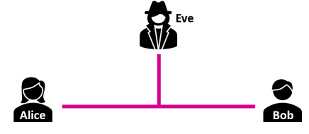
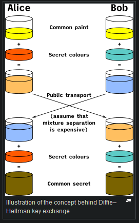

# Diffie Hellmann Key Exchange

Say you have a couple of individuals called Alice and Bob. They want to exchange information through some medium (phone, internet, etc). And then there's Eve who wants to know what's going on.

|  |
| :---------------------------------------------: |
|       Alice and Bob Key exchange example        |

The problem of sharing information through the chosen medium is that by default it would not be encrypted at all, so Eve is able to see exactly what they both are up to. Now you may think that we can easily solve this problem with encryption, but then, how do you establish a secure connection when there exists none in the first place?

This method begins by choosing 2 numbers that will belong to the public area (anyone can see the, i.e., Eve). $g$ will be a small prime number, and $n$ will be a large prime number (as a side note, $g$ must be a primitive root of $n$). Then Alice and Bob pick 2 secret numbers $a$ and $b$ that belong to their respective private areas (either one just has access to its respective secret number).

Alice first sends out a number resulting from the operation:

$$x = g^a \bmod n$$

Bob then sends out a number resulting from the operation:

$$y = g^b \bmod n$$

Having each received the number, now they both calculate the shared secret:

$$\begin{gather*}
    k_A = y^a \bmod n \\
    k_B = x^b \bmod n \\
    k_A = k_B
\end{gather*}$$

And that's it! Recall that $(x^{a})^{b} = x^{ab} = (x^{b})^{a}$. There is (apparently) no way in which Eve can produce the shared secret, since she just has access to $g^{a} \bmod n$ and $g^{b} \bmod n$. There is no way in which you can reproduce the secret key with only those 2 numbers. For illustration, let's look at a Diffie-Hellmann key exchange example without involving nasty maths:

|  |
| :----------------------------------------------------------------------: |
|              Diffie-Hellmann exchange example without maths              |

Note however that this approach is not invulnerable. At first, your mind might think that the only way to crack this process is through a discrete logarithm, but this is not the case. This simple approach to a Diffie-Hellmann key exchange is vulnerable to Man In The Middle attacks. Can you spot why?
