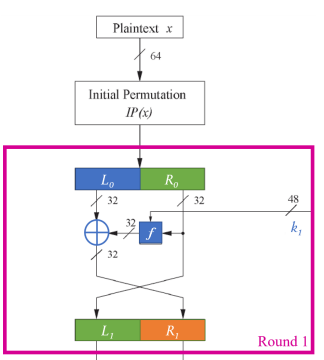

# Encryption Standards

- [Encryption Standards](#encryption-standards)
  - [Symmetric encryption](#symmetric-encryption)
  - [Modes of operation](#modes-of-operation)
    - [Electronic Codebook](#electronic-codebook)
    - [Cipher Block Chaining](#cipher-block-chaining)
    - [Counter Mode](#counter-mode)
  - [DES (Data Encryption Standard)](#des-data-encryption-standard)
  - [AES (Advanced Encryption Standard)](#aes-advanced-encryption-standard)

## Symmetric encryption

Algorithms for cryptography that use the same cryptographic key for both encryption of the plaintext and decryption of the ciphertext. The keys may be identical, or there may be a simple transformation to go between the 2 keys. The keys in practice represent a shared secret between 2 or more parties that can be used to maintain a private information link.

The requirement that both parties have access to the secret key is one of the main drawbacks of symmetric-key encryption. However, symmetric key encryption algorithms are usually better for bulk encryption, they have a smaller key size, which means less storage space and faster transmission.

## Modes of operation

### Electronic Codebook

> Each block of plaintext bits is encoded independently using the same key. It's typically used for secure transmission of single values (i.e. an encryption key)

The simplest mode in which plaintext is handled one block at a time and each block of plaintext is encrypted using the same key. The term codebook is used because, for a given key there is a unique ciphertext for every b-bit block of plaintext. For a message longer than b-bits, the procedure is simply to break the message into b-bit blocks, padding the last block if necessary.

The ECB mode should only be used to secure messages shorter than a single block of the underlying cipher (i.e. 64 bits for 3DES and 128 bits for AES), such as to encrypt a secret key. The most significant characteristic of ECB is that if the same b-bit block of plaintext appears more than once in the message, it always produces the same ciphertext.

See the next images for a visual representation of how ECB works.

|  |
| :---------------------------------------: |
|         ECB encryption procedure          |

|  |
| :---------------------------------------: |
|         ECB decryption procedure          |

And for a pseudo-code example:

For encryption:

```txt
Inputs: key of k bits, plaintext P divided in blocks of n bits.
Output: ciphertext in blocks of n bits.
for j = 1, j <= n, j++ do
    c_j = E_k(P_j)
end for
return C
```

For decryption:

```txt
Inputs: key of k bits, ciphertext C divided in blocks of n bits.
Output: ciphertext in blocks of n bits.
for j = 1, j <= n, j++ do
    p_j = E_k^-1(C_j)
end for
return P
```

### Cipher Block Chaining

> The input to the encryption algorithm is the XOR of the next block of plaintext and the preceding block of ciphertext. It's general purpose block oriented transmission and for authentication.

To overcome the security deficiencies of ECB, we would like a technique in which the same plaintext block, if repeated, produces different ciphertext blocks. This is called cipher block chaining. In this scheme, the input to the encryption algorithm is the XOR of the current plaintext block and the preceding ciphertext block; the same key is used for each block. For starting up this mode we need an initialization vector IV that must be used only once.

|  |
| :---------------------------------------: |
|         CBC encryption procedure          |

|  |
| :---------------------------------------: |
|         CBC decryption procedure          |

And for a pseudo-code example:

For encryption:

```txt
Inputs: key of k bits, IV of n bits, plaintext P divided in blocks of n bits.
Output: ciphertext in blocks of n bits.
c_0 = IV
for j = 1, j <= n, j++ do
    c_j = E_k(c_j-1 XOR P_j)
end for
return C
```

For decryption:

```txt
Inputs: key of k bits, IV of n bits, ciphertext C divided in blocks of n bits.
Output: plaintext P in blocks of n bits.
c_0 = IV
for j = 1, j <= n, j++ do
    p_j = c_j-1 XOR E_k^-1(c_j)
end for
return P
```

### Counter Mode

> Each block of plaintext is XORed with an encrypted counter. The counter is incremented by 1 for each block of plaintext. A general purpose block-oriented transmitter, that is also useful for high-speed requirements.

## DES (Data Encryption Standard)

> Feistel Networks

Feistel proposed the use of a cipher that alternates substitutions and permutations, where these terms are defined as follow:

- Substitution: each plaintext element or group of elements is uniquely replaced by a corresponding ciphertext element or group of elements.
- Permutation: a sequence of plaintext elements is replaced by a permutation of the same sequence. That is, no elements are added or deleted or replaced in the sequence, rather the order in which the elements appear in the sequence is changed.

A Feistel network uses a round function which takes 2 inputs -a data block and a subkey- and returns one output of the same size as the data block. In each round, the round function is run on half of the data to be encrypted, and its output is XORed with the other half of the data. This is repeated a fixed number of times, and the final output is the encrypted data.

An important advantage of Feistel Networks compared to other cipher designs such as substitution-permutation networks is that the entire operation is guaranteed to be invertible (that is, encrypted data can be decrypted), even if the round function is not itself invertible.

The round function can be made arbitrarily complicated, since it does not need to be designed to be invertible. Furthermore, the encryption and decryption operations are very similar, even identical in some cases, requiring only a reversal of the key schedule. Therefore, the size of the code or circuitry required to implement such a cipher is nearly halved.

Example:

|  |
| :-----------------------------------------: |
|              Feistel Networks               |

> DES

- Ciphered in blocks of 64 bits
- Key of 56 bits. There's a total of $2^{56} > 7 \times 10^{16}$ possible keys
- Symmetric key
- Uses 16 rounds of encryption within the same structure
- There's a different sub-key for each round
- A bit permutation is made at the beginning and end of the procedure

|  |
| :------------------------------------------: |
|             DES General overview             |

|  |
| :--------------------------------------: |
|          DES Encryption General          |

|  |
| :--------------------------------------: |
|          DES Decryption General          |

## AES (Advanced Encryption Standard)

> Substitution Permutation Network
