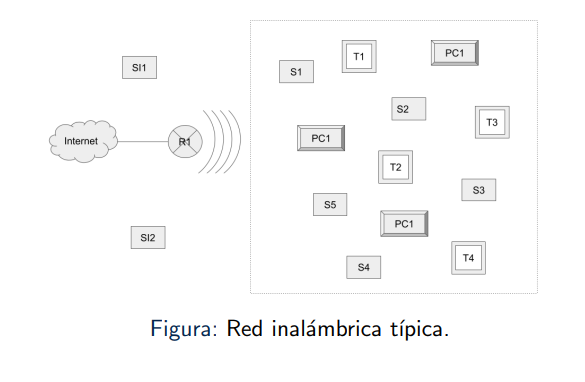

# Security in Wireless Networks

- [Security in Wireless Networks](#security-in-wireless-networks)
  - [Components of a Wireless Network](#components-of-a-wireless-network)
  - [IEEE Standards: IEEE 802.11](#ieee-standards-ieee-80211)
    - [802.11](#80211)
    - [802.11a](#80211a)
    - [802.11b](#80211b)
    - [802.11g](#80211g)
    - [802.11n](#80211n)
    - [802.11ac](#80211ac)
    - [802.11i](#80211i)
    - [Summary](#summary)
  - [WiFi Security](#wifi-security)
    - [Passive attacks](#passive-attacks)
    - [Active attacks](#active-attacks)
  - [WEP Protocol](#wep-protocol)
  - [WPA Protocol](#wpa-protocol)
  - [Setting up a router](#setting-up-a-router)

## Components of a Wireless Network

|  |
| :---------------------------------------------------: |
|               Typical Wireless Network                |

- Router
  - To receive signal from the internet, either through cupper or fiber; depends upon the technology used by the internet provider (ISP)
  - Manage who can connect to the local network, the users will barely notice this functionality
- Tablet: with the means to connect via wifi
- PC: equipped with a wireless chip
- Laptop: equipped with a wireless chip

As we can see in the picture above, there will sometimes exist devices that shouldn't be there at all, note the 2 intruder smartphones that are trying to connect to the local network, effectively stealing resources and making the wifi go slow.

In general, the preferred technique to avoid intruders is to authenticate a new user through a password to the router, for it to recognize it and allow it to surf the internet. This is not sufficient enough, since some of the protocols that implement this technique are not robust enough.

## IEEE Standards: IEEE 802.11

How a wireless network works is managed by the standard IEEE 802.11 created by the Institute of Electrical and Electronics Engineers (IEEE). The community does not say this weird number every time they want to talk about this protocol, normally we speak about Wi-Fi (Wireless Fidelity) or WLAN (Wireless Local Area Network).

As of today there exists 2 major organizations that help establish its adoption and usage, the IEEE and the Wireless Fidelity Alliance, the latter being more focused on the end user (users, enterprises or governments).

As with every standard, as time goes by, new flaws are found, improvements are made, an overall changes are implemented, as a consequence of this, there does not exist a single 802.11, but rather versions of it denoted with a letter at the end, for example: 802.11g.

### 802.11

First version implemented in 1997, the slowest version of them all, his speeds go between 1 and 2 Mbps and it operates at a band of 2.4 GHz according to the ISM standard (Industrial, Scientific and Medical), it does not need an operational license.

### 802.11a

Implemented in 1999, this version further increases the speed to a range between 6 and 54 Mbps, although it is assumed that the top speed was actually 24 Mbps, works with a 5 GHz band according to the specifications made by the Unlicensed National Information Infrastructure (U-NII). Not compatible with the future versions 802.11b and 802.11g.

### 802.11b

Implemented in 1999, has a working speed between 1 and 11 Mbps and operates at a band of 2.4 GHz under the ISM specifications, compatible with 802.11g.

### 802.11g

Implemented in 2003, it's the direct successor of 802.11b, compatible with the previous version but can handle more connected devices. Works at the same 2.4 GHz band but has a speed of 54 Mbps.

### 802.11n

Implemented in 2009 and its the first version that operates with 2 bandwidths (in the business we say it's dual band), 2.4 GHz and 5 GHz. It's also backwards compatible with 802.11a, 802.11b and 802.11g. Its operation range lies between 100 and 450 Mbps, thanks to a scheme where Single User Multiple Input Multiple Output (SU-MIMO) and Orthogonal Frequency Division Multiplexing (OFDM) are mixed. Furthermore, its the first version that supports 2 bandwidths, 20 MHz and 40 MHz.

### 802.11ac

Came to be between 2014 and 2016, this version is backwards compatible with 802.11n, its top speed is 866.7 Mbps if the version 1 is used (also referred to as _Wave 1_) or 1.73 Gbps (with _Wave 2_). Operates with the 2 bands 2.4 and 5 GHz, and with the bandwidths 20, 40, 80, 160 MHz. It uses SU-MIMO for Wave 1 and MIMO-MU for Wave 2.

### 802.11i

Backwards compatible with 802.11n, not formally included with all the afore mentioned standards, but its considered the standard to define the specifications of the WPA protocol.

### Summary

| Wi-Fi Standard | Protocol |
| :------------: | :------: |
|     WiFi 1     | 802.11b  |
|     WiFi 2     | 802.11a  |
|     WiFi 3     | 802.11g  |
|     WiFi 4     | 802.11n  |
|     WiFi 5     | 802.11ac |

## WiFi Security

We are looking to provide:

1. Authentication
2. Confidentiality
3. Availability
4. Integrity

### Passive attacks

- Eavesdropping: where the network's traffic is being monitored
- Traffic Analysis: with bad intents

### Active attacks

- Masquerading: to access the network without proper authorization
- Replay: where a transmission is intercepted and is then retransmitted from another device, effectively supplanting the original sender
- Message modification: where a message can be deleted, altered, reordered or modified
- Denial of Service (DoS): where access to a network is limited or denied to a legitimate user, the classical, _I can't connect to the WiFi_ or _The Wi-Fi is slow_

## WEP Protocol

Wired Equivaled Privacy, or WEP, this protocol represents a typical schema of _Challenge and Response_, in other words, we trust the user to have the secret key to authenticate himself.

## WPA Protocol

## Setting up a router
