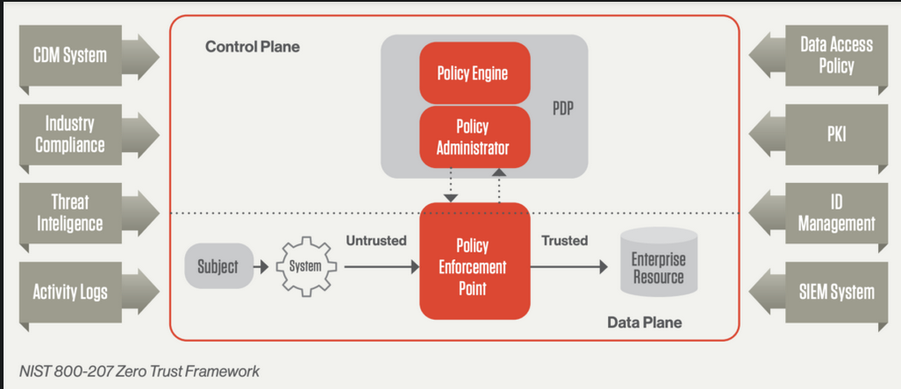

# Zero Trust Security

- [Zero Trust Security](#zero-trust-security)
  - [Key Principles](#key-principles)
    - [Continuous Verification](#continuous-verification)
    - [Limit the Blast Radius](#limit-the-blast-radius)
    - [Automate Context Collection and Response](#automate-context-collection-and-response)
  - [How to implement Zero Trust?](#how-to-implement-zero-trust)
  - [Common questions to Zero Trust Providers](#common-questions-to-zero-trust-providers)
  - [Well known Zero Trust Providers](#well-known-zero-trust-providers)

[Main reference](https://www.crowdstrike.com/cybersecurity-101/zero-trust-security/)

> Security framework requiring all users, whether in or outside the organization's network, to be **authenticated, authorized and continuously validated** for security configuration and posture before being granted or keeping access to applications and data.

- Zero trust assumes that there is **no traditional network edge**, networks can either be local, in the cloud or a mixture of both.

|  |
| :-----------------------------------------: |
|    NIST 800-207 Zero Trust Architecture     |

## Key Principles

The Zero Trust model (based on the NIST 800-207) is based on 3 key principles:

1. **Continuous Verification**: always verify access, all the time for all the resources
2. **Limit the blast radius**: minimize impact if an external or insider breach occurs
3. **Automate context collection and response**: incorporate behavioral data and get context from the entire IT stack for the most accurate possible response

### Continuous Verification

> No trusted zones, credentials or devices at any time. **Never trust, always verify**, it must be applied to a broad set of assets making sure that various key elements are in place for the verification process to be effective:

1. **Risk based conditional access**: ensures the workflow is only interrupted when risk levels change, allowing continual verification, _without sacrificing user experience_
2. **Rapid and scalable dynamic policy model deployment**: since workloads, data, and users can vary often, the policy **must not only account for risk**, but also include **compliance** and IT requirements for policy, it does alleviate organizations and businesses from compliance and organizational specific requirements

### Limit the Blast Radius

> Minimizing the impact of the breach is critical, Zero Trust limits the scope of credentials or access paths for an attacker, giving time for systems and people to respond and mitigate the attack

1. **Using identity based segmentation**: traditional network based segmentation can be tough to maintain operationally as workloads, users, data and credentials change often
2. **Least privilege principle**: whenever credentials are used, including for non-human accounts (think of the windows service accounts you encountered at Epicor), it is critical these credentials are given access to the minimum capability they require to perform their functions. As tasks evolve so must their credentials, a lot of attacks take advantage of **over-priviliged** service accounts that are not typically monitored

### Automate Context Collection and Response

> More data helps as long as it can be processed and acted on fast enough (in real-time). NIST suggests collecting information on the following:

1. User credentials: human and non-human accounts
2. Workloads: including VMs, containers, and ones deployed in hybrid deployments
3. Endpoints: any deviced used to access data
4. Network
5. Data
6. Other sources (typically accessed with APIs):
   1. SIEM: Security Information and Event Management
   2. SSO: Single Sign On
   3. Identity Providers (Active Directory)
   4. Threat intelligence

## How to implement Zero Trust?

1. **Visualize**: _understand_ **all** of the resources, their access points and visualize risks involved
2. **Mitigate**: _detect and stop_ threats or mitigate impact of the breach in case it cannot be immediately stopped
3. **Optimize**: _extend_ protection to every aspect of the IT infrastructure and all resources regardless of location while optimizing the experience for end-users, IT and security teams

## Common questions to Zero Trust Providers

1. Are they compliant with NIST 800-207?
   1. Guarantees that we don't need to change our architecture if they do comply
2. How do they mitigate threats involving...?
   1. Human credentials
   2. Service accounts credentials
   3. Identity directories (such as Active Directory)
3. Do they implement a policy focused on risks for Zero Trust?
   1. Their policies should be based in dynamic risk assessments and must only be triggered when risk levels change, at a user, device, workload or data level
4. What kind of data can you process in real-time without creating large log files?
   1. For Zero Trust to work properly, the gathered data must be processed and analyzed in real-time, which avoids the need to create large log files
   2. The correlation between devices and users is fundamental for understanding the history (and nature of an attack)
5. What aggregate value can you provide beside the base Zero Trust model?
6. Can your Zero Trust solution be applied to my providers and partners?
   1. A well designed Zero Trust solution must contain APIs that allow for integration with common service providers and partners, to guarantee that the already collected data and systems can be used
7. How do you protect me against legacy and un-managed devices?
   1. Zero Trust is only efficient if it can protect **all users**

## Well known Zero Trust Providers

|                    |                   |
| :----------------- | :---------------- |
| Palo Alto Networks | Proofpoint        |
| Fortinet           | Rapid7            |
| Cisco              | Check Point       |
| CrowdStrike        | Trend Micro       |
| IBM                | Broadcom          |
| OneTrust           | McAfee Enterprise |
| Okta               | RSA               |
| Zscaler            | Sophos            |
| KnowBe4            | Splunk            |
| Darktrace          | Microsoft         |
