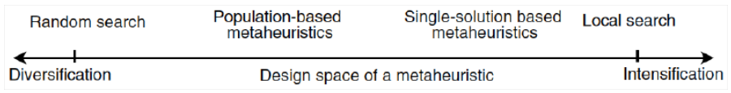

# Complexity and Systems Based in Nature

We generally would like to solve an optimization problem, the first step is to model it, usually through the aide of mathematics. Once the researcher has a mathematical model to optimiza, he often must decide between 3 avenues:

1. **Exact methods**: analytical solutions to an optimization problem, the quality of the answer is guaranteed to be optimal, but the problem itself might become intractable, making these methods practically impossible to use in some scenarios
2. **Heuristics**: an algorithm that locates _good enough_ solutions to a problem without concern for whether the solution can be proven to be optimal or correct; they trade-off concerns such as precision, quality, and accuracy in favor of computational effort
3. **Metaheuristics**: they may be considered a general algorithmic framework that can be applied to different optimization problems with relative few modifications to adapt them to a specific problem. The difference is that metaheuristics are intended to extend the capabilities of _heuristics_ by combining one or more heuristic methods.
   1. They _guide_ the search process
   2. They efficiently (we hope so) explore the search-space in order to find near-optimal solutions
   3. They are approximate and non-deterministic
   4. They incorporate mechanisms to avoid getting trapped in confined areas of the search space, aka. local optima.

## Properties of the solutions

- Intensification (exploitation):
  - Makes reference to how much we value the quality of the solution throughout the optimization process
  - They focus the search on promising areas of the search space
- Diversification (exploration):
  - Makes reference to how much we value finding different solutions throughout the optimization process
  - It encourages useful exploration of the broader search space

|  |
| :-----------------------------------------------------------: |
|                Design space of a metaheuristic                |

## Complexity

An algorithm needs 2 essential resources to solve a problem, time and space. The time complexity of an algorithm is defined in terms of the number of steps needed to solve a problem of size $n$ in the worst case scenario. The main goal of calculating computational complexity is not to just exactly calculate the required number of steps, but obtaining an _upper bound_ on that quantity.

An algorithm is said to have complexity $f(n) = O(g(n))$ if there exists a positive number $n_0$ and $c$ such that $\forall n > n_0, f(n) \leq c \cdot g(n)$:

1. **P problems**: optimization problems where there exists an algorithm of order $O(p(n))$ for some polynomial $p(n)$
2. **NP problems**: problems for which it is possible to verify the validity of a solution in polynomial time, but it may not be possible to find a solution in polynomial time
3. **NP complete problems**: a problem that cannot be solved in polynomial time
