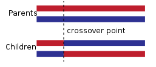

# Genetic Algorithms

- [Genetic Algorithms](#genetic-algorithms)
  - [General idea](#general-idea)
  - [GA Process](#ga-process)
    - [Selection](#selection)
    - [Crossover](#crossover)
    - [Mutation](#mutation)
    - [Fitness function](#fitness-function)
    - [Stopping criteria](#stopping-criteria)
  - [GA Algorithm](#ga-algorithm)

> A metaheuristic inspired by the process of natural selection, they belong to the class of evolutionary algorithms.

- Commonly used to generate high-quality solutions to optimization and search problems by relying on bio-inspired operators such as mutation, crossover and selection.
- They are stochastic
- Efficient to explore very large search spaces (feasible region) to gradually evolve towards better feasible solutions
- Each feasible solution is thought of as chromosome coded by a set of genes
- A set of N chromosomes is known as a population
- The quality of a solution is measured by a fitness function, a fit chromosome has a higher value for the fitness function
- The information about the solution is encoded in the genes of the chromosome, and through the crossover process the critical information about said solution is maintained
- The new members of the population replace the worst members of the population

## General idea

Two parents are selected from the feasible population, then the genes of the 2 parents is mixed through the crossover process, and then the resulting chromosome mutates (with a certain probability). The new offspring of the last iteration replaces the worst members of the population (there are variants of GAs in which a single child is generated, others create 2). This process is then repeated for a certain number of iterations.

|  |
| :--------------------------------------: |
|          *General idea of a GA*          |

## GA Process

- Let $N$ be the number of chromosomes in the population $P$, $N$ must be finite. It can be chosen at random, by the researcher or through some constructive process guided by an heuristic
- Each individual $S_i$ in the population $P$ has an associated chromosome, that encodes all the information about the individual
- There are many ways in which the chromosome $S_i$ can be encoded, the most common is to use a binary string, where each bit represents a gene

### Selection

Each individual in the population has an associated probability of being chosen for reproduction:
$$\begin{equation}
    p_i = \frac{f(S_i)}{\sum_{j=1}^N f(S_j)}
\end{equation}$$

- One must choose the best solutions in terms of the fitness function
  - They can be chosen at random (with some direct proportion to the fitness function)
- The least fit solutions are not to be discarded completely, this will improve the diversification process, hoping to escape local optimas

### Crossover

The next step is to generate a second generation population of solutions from those selected.

- One point crossover: a point on both parent chromosomes is picked randomly, this is called the cross-over point. Bits to the right of that point are swapped between the 2 parent chromosomes

|  |
| :-------------------------------------------------: |
|                *One Point Crossover*                |

- Two point crossover (k-point crossover): two crossover points are chosen randomly. The bits in between the 2 points are swapped between the parent organisms

|  |
| :-------------------------------------------------: |
|                *Two Point Crossover*                |

- Uniform crossover: typically, each bit is chosen from either parent with equal probability, same as in flipping a coin. We can bias this coin so that the offspring has more genetic material from one parent

> It's important to design a crossover operator that guarantees the offspring to be feasible

### Mutation

- $n$ descendants from the new population will be chosen to mutate
- The mutation occurs with a certain probability $p_m$, genes do not always mutate, not all chosen descendants will mutate
- Any part of the feasible region must be reachable, and it must guarantee that the mutated individual is feasible
- The size of the mutation is determined by the researcher, it can be a constant or a random value

|  |
| :-------------------------------------------: |
|              *Mutation example*               |

### Fitness function

> The population evolves based on the fitness function

1. The objective function is usually the to-go fitness function
2. An approximation of the objective function can be used when the objective function is too complex to be evaluated
3. It's recommended that the restrictions of the problem be added as penalties in the fitness function
4. When dealing with a multi-objective problem, one searches for a **compromise solution**

### Stopping criteria

- A solution is found that satisfies minimum criteria
- Fixed number of generations reached
- Allocated budget (computation time/money) reached
- The best individual has reached a plateau
- Manual inspection
- Mixture of the above

## GA Algorithm

